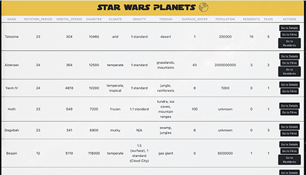
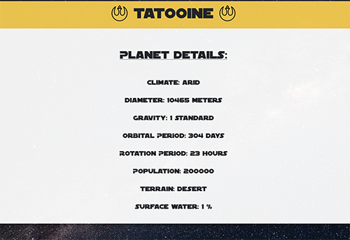
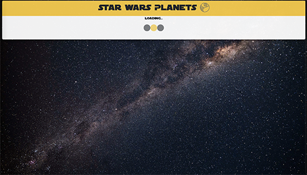
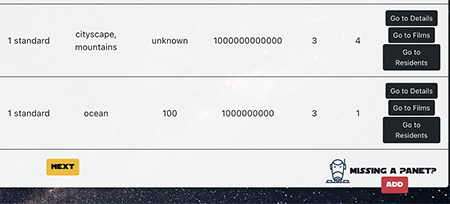
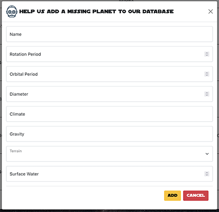
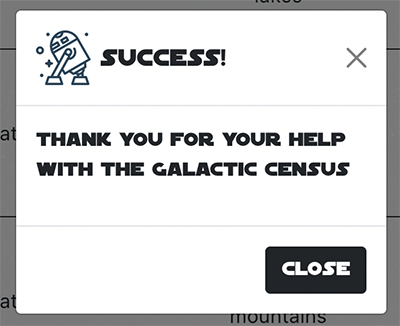
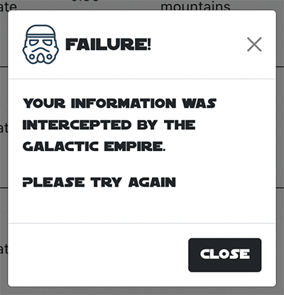
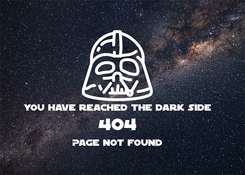

# Star Wars API Planets

Enter the Star Wars universe by exploring the planets which makes it up, all information is called by API to the react client via Redux Toolkit and Axios

## Mockups

## Technology used

- React v17
- React-router v5
- Redux Toolkit
- Axios
- Reactstrap

